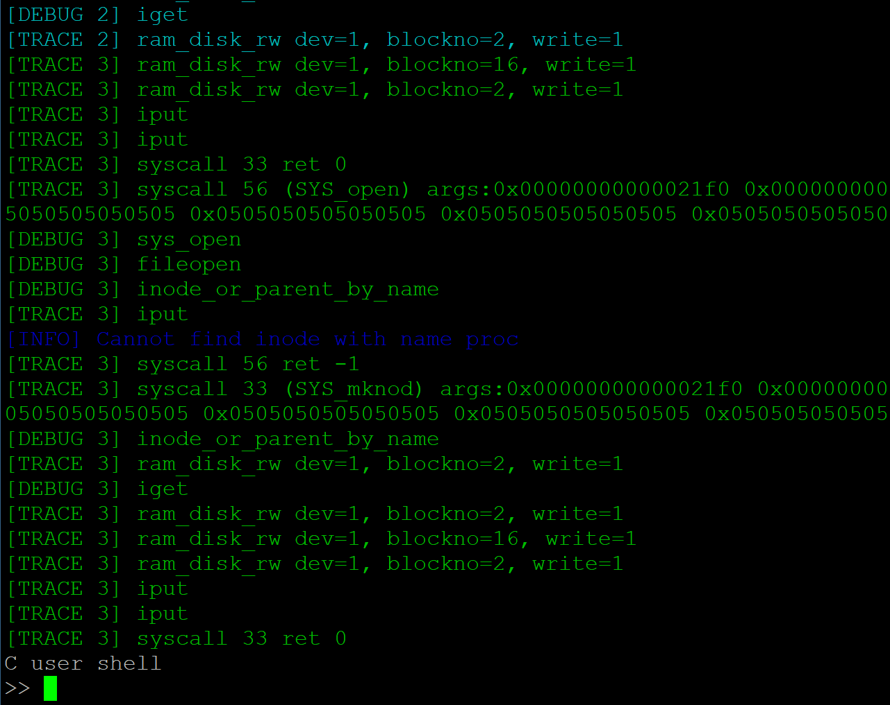

## Stage-1：前期调研 10.16~10.23

#### 1.[TOCK](https://github.com/tock/tock)

- 面向低功耗平台，利用Rust类型安全的特性，为微控制器提供多道程序设计环境

- 低功耗的设计目标舍弃了复杂的内存隔离和动态内存管理，提供更简单的环境

- 安全问题成为了很大的考验

- TOCK提供错误隔离和动态内存分配，在应用和应用，应用和内核间提供进程抽象

  ##### 相关特性：

- **Grants**：动态堆空间划分给不同进程，用于管理进程请求
- **Threat Model**：通过划分用户群体提供应对威胁的方法
- **Capsules**：内核的组成单元；内核共享一个内核栈；无法在运行时加载
- **Processes**：常规进程；不支持虚拟化、采用异步系统调用

#### 2.[Barrelfish](http://www.barrelfish.org/documentation.html)

- 一个实验操作系统，非常复杂，仅大致浏览，主要用来实践有关多内核的设计
- 内核(CPU Driver)调度进程(Dispatcher)运行，Dispatcher调度线程运行
- 内核提供基于权能(Capability)的系统调用
- 线程调度、内存管理、文件系统等按照微内核的设计思想在用户层实现

#### 3.zCore

- [zCore Tutorial](https://rcore-os.github.io/zCore-Tutorial/)

## Stage-2：初步移植 10.23~10.30

#### 1. boot常用资料

##### 1.1 U-Boot

- **loadb**：通过串口下载二进制文件
- **printenv**：打印环境变量，包括启动设备和起始地址等
- **setenv**：设置环境变量，例如boot之后运行的脚本选项：
  - **baudrate**：串口波特率，默认为115200
  - **boot_targets**：列表包含nvme0，usb0，mmc0等，其中nvme0为SSD卡，我们拿到的主机上已装好了ubuntu系统；usb0为外接USB设备，mmc0即为SD卡，将该选项改为mmc0即可；
  - 此外还包含一些网络相关的配置，可以从远程加载系统
- **fdt print /cpus；fdt list /cpus**：查看设备信息，如图；可以看到cpu相关信息，大核和小核的架构不同，小核不支持页表，不支持浮点运算，且没有**d-cache**

##### 1.2 SD Card 默认分区简介 

- U-Boot SPL
- U-Boot ITB（DTB with U-Boot overlay，OpenSBI generic FW_DYNAMIC，U-Boot proper）

- FAT16分区，命名为**boot**，包含设置信息(EXTLINUX configuration)，内核镜像以及设备树信息(device tree blob)
- EXT4分区，命名为**root**，包含由**FUSDK**构建的文件系统

#### 2. uCore-SMP移植

- 重现陶天骅学长的工作，进一步了解环境配置和编译流程
- 最终移植效果如下：


#### 3. zCore移植

- 参考uCore-SMP的移植流程，对zCore进行编译和配置，执行以下命令构建镜像：

  ```makefile
  gzip -9 -cvf $(build_path)/zcore.bin > $(build_path)/zcore.bin.gz

  mkimage -A riscv -O linux -C gzip -T kernel -a 80200000 -e 80200000 -n "zCore-fu740" -d $(build_path)/zcore.bin.gz $(build_path)/zcore-fu740
  ```

- 修改页表相关配置，物理地址设置为从0x80000000开始

- 查看A和D的设置情况，发现已经默认设置为1，不用再修改

- 最终移植效果如下：


#### 4. [参考资料](doc/)
#### 5. 未来计划 （TKF）
- 研究研究如何实现相关设备驱动（串口、SSD）
- 参考tock的部分实现机制，尝试编写一个相对轻量的内核（拟命名为tCore
- 在S7 RISC-V Core（小核）上运行tCore
- 如何调度不同的系统？小核上的系统将扮演怎样的角色？